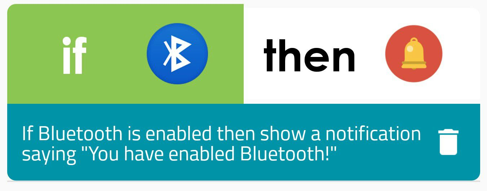
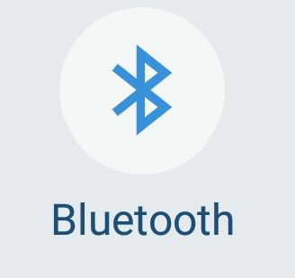
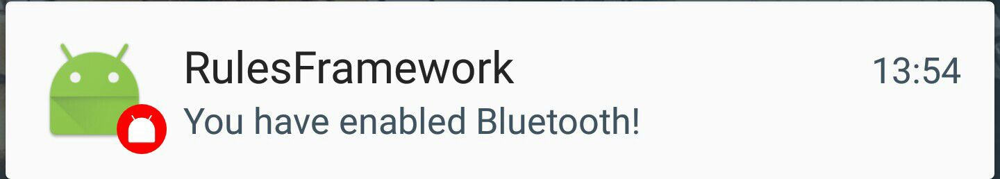
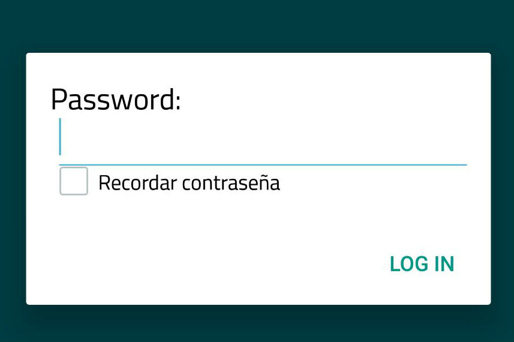

#Installation
First of all, clone the git project locally and access to ewe-tasker-android directory.

```
git clone https://github.com/gsi-upm/ewe-tasker-android.git
cd ewe-tasker-android

```
Open and compile the project from Android Studio or drag and drop the apk file to your smartphone


```
EWETaskerMobile.apk

```

You can also download it from Play Store (Android devices only).

<a href="https://play.google.com/store/apps/details?id=es.dit.gsi.rulesframework">https://play.google.com/store/apps/details?id=es.dit.gsi.rulesframework</a>

#Enabling Technologies

</br>
This application uses **EWE** ontology for channel modelling. **EWE** ontology models the most important aspects of TAS from a descriptive approach, that enables service disovery and semantic rule definition featuring reasoning.


This application uses **EYE** which stands for *Euler Yet another proof Engine*, and it is a further development of Euler which is an inference engine supporting logic based proofs. EYE is a semibackward reasoner enhanced with Euler path detection. The core of **EYE** accepts **N3** (*Notation 3*) code, which is a Prolog representation resulting from parsing *RDF* triples and N3 rules.


#User Guide
##Rules Framework
###Rule Definition Module
In this section we will create a rule using the default channels hosted in the public server. You can start by pressing the '+' button. The rule we want to create will have an **ECA** (Event - Condition - Action) structure i.e. ***If Bluetooth is enabled then show a notification saying "You have enabled Bluetooth!"*** . First of all we will choose the Bluetooth channel as **IF** actor selecting the *Turn On* as triggering event. Then, we will select the Notification module as **DO** performer, filling in the *Show* action the text we want to show (*You have enabled Bluetooth!*). Finally, it is necessary to complete the rule context data like title, description or place.

<p align="center">

</p>

###Rule Execution Module
We can test the test rule created in the previous step by enabling the Bluetooth. As result we obtain the customized notifification created in the rule definition process.
<p align="middle">



</p>
##Beacon Listener
In this screen the application will be listening all the beacons located near the smartphone every 10 seconds. This channel gets is named *Presence Sensor*, and requires Bluetooth enabled. The parameters are the sensor ID and the distance between the beacon and the smartphone.

###Door opening
In particular, we will explain how the rule ***when I arrive work (less than 2 meters), open the smart door***. The smartphone must be in the listening beacon screen. When the phone is located at a distance less than 2 meters from the beacon, an allert dialog will pop up requesting the password and opening the door if success.

<p align="center">

</p>

*Note: Request the GSI access password to the lab master*

#License
 Copyright Antonio Fernández Llamas

   Licensed under the Apache License, Version 2.0 (the "License");
   you may not use this file except in compliance with the License.
   You may obtain a copy of the License at

       http://www.apache.org/licenses/LICENSE-2.0

   Unless required by applicable law or agreed to in writing, software
   distributed under the License is distributed on an "AS IS" BASIS,
   WITHOUT WARRANTIES OR CONDITIONS OF ANY KIND, either express or implied.
   See the License for the specific language governing permissions and
   limitations under the License.
   
#References
<a href="http://www.gsi.dit.upm.es/index.php/es/investigacion/publicaciones?view=publication&task=show&id=398">[1]</a>*"Design and implementation of a Semantic Task Automation Rule Framework for Android Devices"*

<a href="http://www.gsi.dit.upm.es/index.php/es/investigacion/publicaciones?view=publication&task=show&id=396">[2]</a>*"Development of a Task Automation Platform for Beacon enabled Smart Homes"*

<a href="https://github.com/gsi-upm/ewe-tasker">[3]</a>*"EWE Tasker - Server Documentation"*

<a href="http://www.gsi.dit.upm.es/index.php/es/investigacion/publicaciones?view=publication&task=show&id=387">[4]</a>*"Task Automation Services: Automation for the masses"*

<a href="http://n3.restdesc.org/">[5]</a>*"Semantic Web Reasoning With EYE"*
